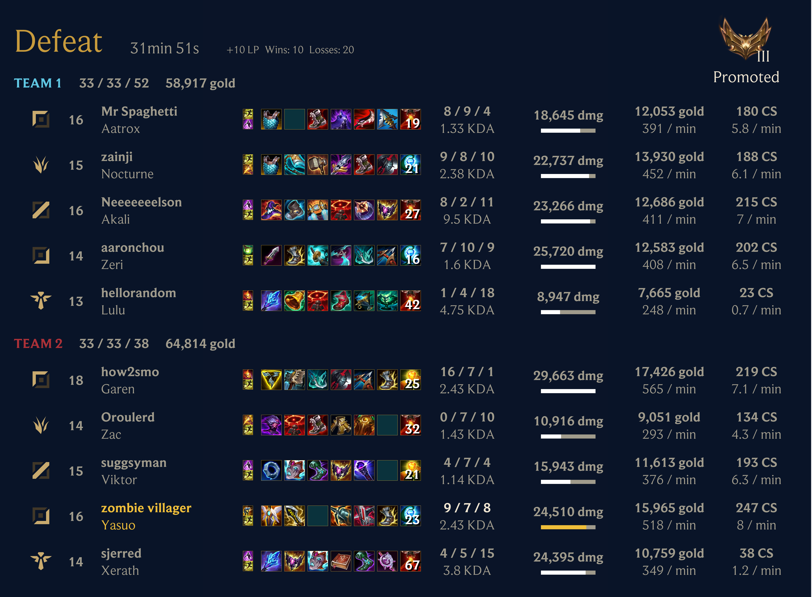

# Scout for League of Legends

A Discord bot that automatically tracks your friends' League of Legends matches, delivering notifications when games end and beautiful post-match reports with detailed statistics directly to your Discord server.



## Features

### 📊 Detailed Post-Match Reports

Automatically generated reports featuring:

- Complete performance statistics (KDA, damage, gold, CS)
- Champion portraits and item builds
- Team compositions with role indicators
- Ranked progress tracking with LP gains/losses
- Win/loss outcomes and match duration

### 🏆 Competitions & Leaderboards

Create custom competitions with configurable criteria:

- **Season Support**: Align with League seasons (e.g., 2025 Split 1) or use custom dates
- **Edit Anytime**: Update competition details before they start
- **Multiple Criteria**: Most Wins, Highest Rank, Most Rank Climb, Highest Win Rate, etc.
- **Queue Filtering**: Track specific queues (Solo/Duo, Flex, Arena, ARAM) or all games
- **Leaderboards**: Automatically updated daily
- **Champion-Specific**: Create competitions for specific champions

### ⚡ Arena Mode Support

Full support for League's Arena mode with detailed reports for all 16 players, including:

- Complete statistics for all 8 teams with team KDA
- Augment icons showing selections throughout the match
- Final placements and performance metrics
- Optimized report layout for better readability

### 🌍 Multi-Region Support

Track players across all League of Legends regions: NA, EUW, EUNE, KR, BR, LAN, LAS, TR, RU, OCE, JP, PH, SG, TH, TW, VN, ME.

## Getting Started

### 1. Add Scout to Your Server

[**Click here to add Scout to Discord**](https://discord.com/oauth2/authorize?client_id=1182800769188110366)

You'll need Administrator permissions to add the bot to your server.

### 2. Subscribe to Players

Use the `/subscription add` command to start tracking players:

```text
/subscription add channel:#general region:na1 riot-id:PlayerName#TAG alias:FriendlyName
```

**Parameters:**

- `channel`: Discord channel where notifications will be posted
- `region`: League of Legends region (na1, euw1, kr, etc.)
- `riot-id`: Player's Riot ID in format "GameName#TagLine"
- `alias`: Friendly display name for notifications

**Limits:**

- Up to 50 unique Riot accounts per server
- Up to 75 total subscriptions per server (same account can be tracked in multiple channels)

### 3. Enjoy Automatic Updates

Scout automatically checks for matches every minute and posts:

- Notifications when tracked players start matches
- Detailed reports when games end (2-5 minutes after completion)

## Commands Overview

### Basic Commands

- `/subscription add` - Track a League player in your server
- `/subscription delete` - Stop tracking a player
- `/subscription list` - View all tracked players

### Competitions

- `/competition create` - Create a new competition with custom criteria
- `/competition edit` - Modify competition details
- `/competition list` - View all competitions (with optional filters)
- `/competition view` - See competition details and leaderboard
- `/competition join` - Join an open competition
- `/competition leave` - Leave a competition
- `/competition cancel` - Cancel a competition (owner only)
- `/competition invite` - Invite users to private competitions

### Admin Commands (Administrator Only)

- `/admin player-edit` - Change a player's display name
- `/admin account-delete` - Remove a Riot account from a player
- `/admin account-add` - Add a Riot account to a player
- `/admin account-transfer` - Transfer an account between players
- `/admin player-merge` - Merge two players into one
- `/admin player-delete` - Permanently delete a player
- `/admin player-link-discord` - Link a Discord user to a player
- `/admin player-unlink-discord` - Unlink a Discord user from a player
- `/admin player-view` - View detailed player information

## Technical Details

**Built With:**

- TypeScript + Bun runtime
- Discord.js for bot framework
- Prisma for database ORM
- React + Satori for report generation
- Zod for runtime validation
- Dagger for CI/CD

**Architecture:**

- Monorepo structure with multiple packages
- Automatic match polling every minute
- Beautiful SVG/PNG report generation
- SQLite database with optional S3 storage
- Docker containerization for deployment

**Project Structure:**

```text
packages/
  backend/      - Discord bot service
  data/         - Shared types and utilities
  report/       - Report generation components
  frontend/     - Web frontend (Astro)
.dagger/        - CI/CD pipeline definitions
```

**Development:**

- Fast local checks with `mise check`
- Full CI validation with `dagger call check`
- Type-safe with strict TypeScript
- Comprehensive test coverage
- Automated linting and formatting

**Environment:**
The bot requires API tokens for Discord and Riot Games. In test mode (`NODE_ENV=test`), placeholder values are used automatically—no real tokens needed for development!

## Links

- **Website**: [scout-for-lol.com](https://scout-for-lol.com)
- **Documentation**: [scout-for-lol.com/docs](https://scout-for-lol.com/docs)
- **What's New**: [scout-for-lol.com/whatsnew](https://scout-for-lol.com/whatsnew)
- **Add to Discord**: [Install Scout](https://discord.com/oauth2/authorize?client_id=1182800769188110366)
- **GitHub**: [shepherdjerred/scout-for-lol](https://github.com/shepherdjerred/scout-for-lol)
- **Support**: [GitHub Issues](https://github.com/shepherdjerred/scout-for-lol/issues)

## Privacy & Terms

Scout stores only the minimum data necessary to provide notifications: Riot IDs, aliases, Discord channel information, and match history for competitions. We don't collect personal information beyond what's required for the service.

See [Privacy Policy](https://scout-for-lol.com/privacy) and [Terms of Service](https://scout-for-lol.com/tos) for details.

---

**Never miss a League match again!** Track your friends' games and watch them climb (or fall) in real-time.
