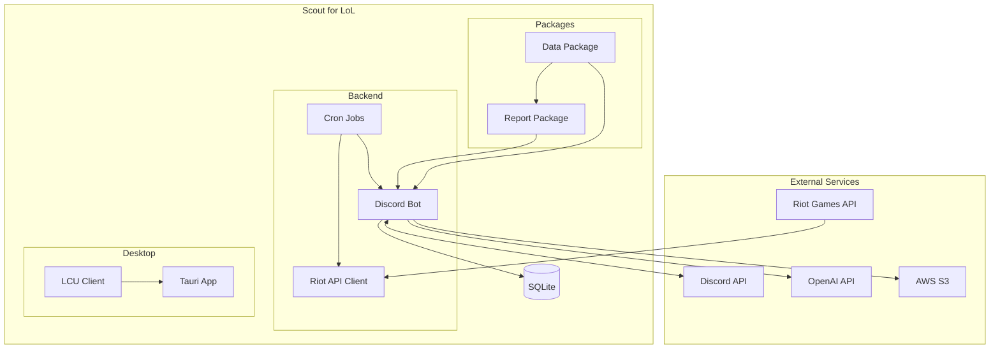

# Scout for LoL - Technical Documentation

Technical documentation for Scout for LoL, a Discord bot and desktop application that monitors League of Legends matches and generates AI-powered match reviews.

## Documentation Index

| Document                                   | Description                                               |
| ------------------------------------------ | --------------------------------------------------------- |
| [Architecture Overview](./architecture.md) | High-level system architecture and component interactions |
| [Backend Service](./backend.md)            | Discord bot, cron jobs, and API integrations              |
| [AI Review System](./ai-review-system.md)  | Match analysis and art generation pipeline                |
| [Desktop Application](./desktop.md)        | Tauri desktop client architecture                         |
| [Database Schema](./database.md)           | Prisma models and data relationships                      |

## Quick Architecture Overview



## Tech Stack

| Category      | Technology                   |
| ------------- | ---------------------------- |
| Runtime       | Bun                          |
| Language      | TypeScript (strict mode)     |
| Database      | SQLite + Prisma ORM          |
| Bot Framework | Discord.js                   |
| Desktop       | Tauri + React                |
| Reports       | React + Satori + Resvg       |
| AI            | OpenAI GPT-4o-mini / GPT-5.1 |
| External APIs | Riot Games API (twisted)     |
| Storage       | AWS S3                       |
| Monitoring    | Prometheus + Sentry          |

## Package Overview

```text
packages/
├── backend/   # Discord bot, cron jobs, API integrations
├── data/      # Shared models, schemas, and utilities
├── report/    # Match report image generation
├── frontend/  # Astro web interface
└── desktop/   # Tauri desktop application
```

## Key Concepts

- **Subscription**: Links a player to a Discord channel for match notifications
- **Competition**: Team-based events with leaderboards and various win criteria
- **Match Report**: PNG image with match stats generated via Satori
- **AI Review**: GPT-4o-mini analysis of match performance
- **Art Generation**: AI-generated artwork based on match review
