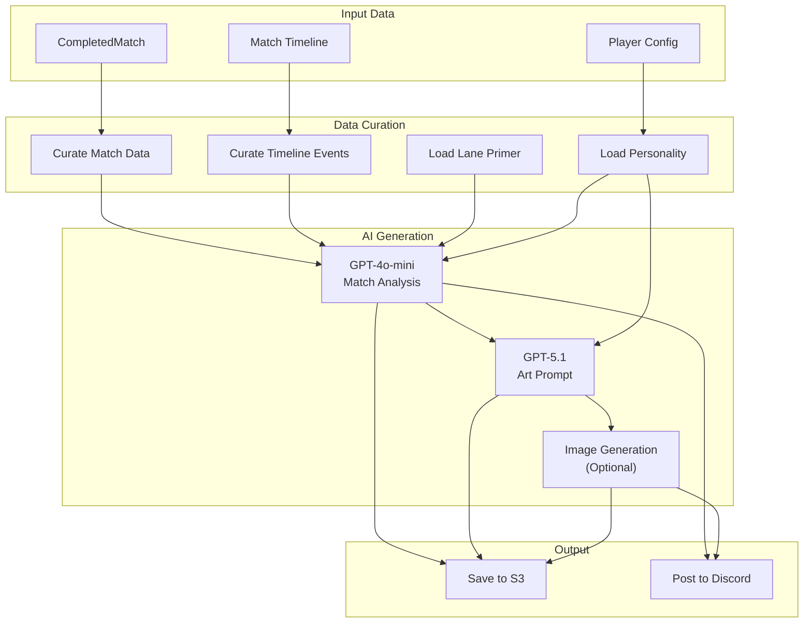
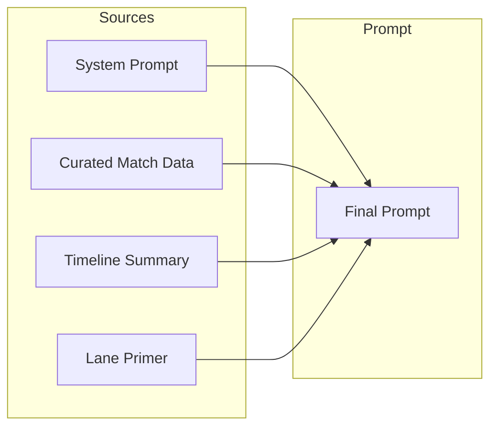
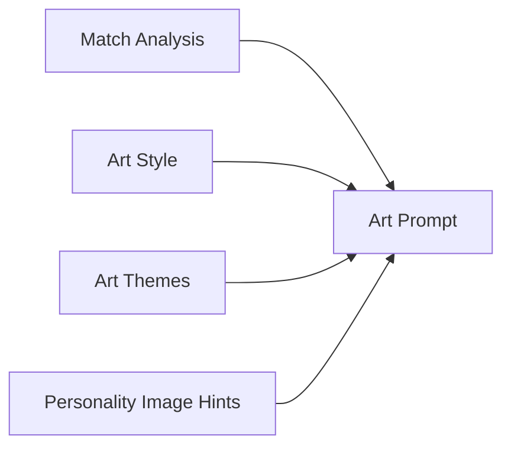
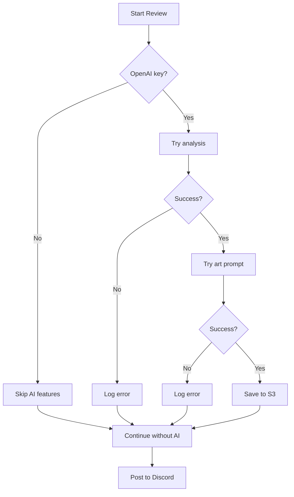

# AI Review System

The AI review system generates match analysis and art prompts using OpenAI's GPT models. This document covers the complete pipeline from match data to Discord post.

## Pipeline Overview



## AI Models Used

| Model         | Purpose        | Temperature | Max Tokens | Cost (per 1M)        |
| ------------- | -------------- | ----------- | ---------- | -------------------- |
| `gpt-4o-mini` | Match analysis | 0.4         | 3000       | $0.15 in / $0.60 out |
| `gpt-5.1`     | Art prompt     | 0.8         | 600        | $1.25 in / $10 out   |

## Match Analysis

### Input Construction

The analysis prompt is built from multiple sources:



### System Prompt Structure

```text
You are a League of Legends analyst creating a match review.

Focus on:
- Game flow and key moments
- Player performance in their lane
- Specific improvement suggestions

Format:
- ~220 words total
- Summary paragraph
- 3-5 bullet points with numbers
- 1-2 improvement ideas
```

### Data Curation

The `curateMatchData()` function extracts relevant stats:

```typescript
interface CuratedMatchData {
  player: {
    champion: string;
    lane: string;
    kda: { kills: number; deaths: number; assists: number };
    cs: number;
    gold: number;
    damage: number;
    visionScore: number;
  };
  team: {
    outcome: "Victory" | "Defeat";
    totalKills: number;
    objectives: { dragons: number; barons: number; towers: number };
  };
  enemy: {
    laner: { champion: string; kda: object };
  };
  gameDuration: number;
}
```

### Timeline Curation

Key events extracted from match timeline:

| Event Type              | Extracted Info                     |
| ----------------------- | ---------------------------------- |
| `CHAMPION_KILL`         | Killer, victim, assists, timestamp |
| `BUILDING_DESTROYED`    | Tower/inhibitor, team, timestamp   |
| `ELITE_MONSTER_KILL`    | Dragon/Baron, team, timestamp      |
| `CHAMPION_SPECIAL_KILL` | Multi-kills, timestamp             |

### Lane Context

Each lane has a primer loaded from `packages/data/src/prompts/lanes/`:

```text
# Top Lane Context

Focus areas:
- Wave management and freezing
- Teleport usage and map impact
- Split-push pressure
- Team fight frontlining

Key metrics to evaluate:
- CS differential at 10/15 minutes
- Solo kills and deaths
- Tower plates taken
- Teleport effectiveness
```

## Art Prompt Generation

### Input Sources



### Art Styles

Available styles from `packages/data/src/review/art-styles.ts`:

| Style          | Description                  |
| -------------- | ---------------------------- |
| `anime`        | Japanese animation aesthetic |
| `digital-art`  | Modern digital illustration  |
| `oil-painting` | Classical oil painting style |
| `watercolor`   | Soft watercolor aesthetic    |
| `comic-book`   | Bold comic book style        |
| `pixel-art`    | Retro pixel art              |

### Art Themes

| Theme             | Elements                  |
| ----------------- | ------------------------- |
| `epic-battle`     | Action, combat, intensity |
| `serene-victory`  | Peaceful triumph          |
| `dramatic-defeat` | Emotional loss            |
| `team-unity`      | Cooperation, synergy      |
| `solo-carry`      | Individual dominance      |

### Prompt Output

The art prompt generator produces ~120 words describing:

- Scene composition
- Character positioning
- Lighting and mood
- Visual style elements
- Champion-specific details

## Personality System

### Structure

Personalities are defined in `packages/data/src/prompts/personalities/`:

```text
personalities/
├── aaron/
│   ├── metadata.json    # Style configuration
│   └── instructions.txt # Writing style guide
└── default/
    ├── metadata.json
    └── instructions.txt
```

### Metadata Schema

```typescript
interface PersonalityMetadata {
  name: string;
  description: string;
  style: string; // Writing voice
  themes: string[]; // Preferred themes
  imagePrompts: string[]; // Art direction hints
  personalityImageHints: string; // Visual character
}
```

### Instructions File

Free-form text describing the personality's:

- Tone and voice
- Analysis focus areas
- Vocabulary preferences
- Humor/seriousness balance

## Storage

### S3 Structure

```text
s3://bucket/
├── matches/
│   └── {matchId}.json           # Raw match data
├── reports/
│   └── {matchId}-{queue}.png    # Report image
└── ai-reviews/
    └── {matchId}-{queue}/
        ├── analysis.json        # AI analysis + metadata
        ├── art-prompt.json      # Art prompt + metadata
        └── debug.json           # Full request/response
```

### Analysis JSON Schema

```typescript
interface StoredAnalysis {
  matchId: string;
  queueType: string;
  player: string;
  analysis: string;
  model: string;
  tokens: { input: number; output: number };
  cost: number;
  generatedAt: string;
}
```

## Error Handling

### Graceful Degradation



### Token Optimization

To reduce costs and stay within limits:

- JSON data is minified before sending
- Only relevant match data is included
- Timeline is summarized to key events
- Output length is constrained via prompts

## Configuration

### Environment Variables

| Variable         | Required | Description                        |
| ---------------- | -------- | ---------------------------------- |
| `OPENAI_API_KEY` | No       | Enables AI features                |
| `GEMINI_API_KEY` | No       | Google Gemini (not currently used) |

### Fallback Behavior

| Missing Config   | Behavior                        |
| ---------------- | ------------------------------- |
| No OpenAI key    | Skip analysis, post report only |
| Analysis fails   | Continue with report            |
| Art prompt fails | Continue without art            |
| Image gen fails  | Continue without image          |

## Extending the System

### Adding a New Personality

1. Create directory: `packages/data/src/prompts/personalities/{name}/`
2. Add `metadata.json` with style configuration
3. Add `instructions.txt` with writing guide
4. Personality will be auto-discovered

### Adding Art Styles/Themes

Edit `packages/data/src/review/art-styles.ts`:

```typescript
export const ART_STYLES = [
  // ... existing styles
  { id: "new-style", name: "New Style", description: "..." },
];
```

## Cost Tracking

### Per-Review Estimate

| Component         | Tokens (approx) | Cost        |
| ----------------- | --------------- | ----------- |
| Analysis input    | ~2000           | $0.0003     |
| Analysis output   | ~400            | $0.00024    |
| Art prompt input  | ~600            | $0.003      |
| Art prompt output | ~150            | $0.00225    |
| **Total**         |                 | **~$0.006** |

### Monitoring

Costs are logged to S3 with each generation for tracking and optimization.
