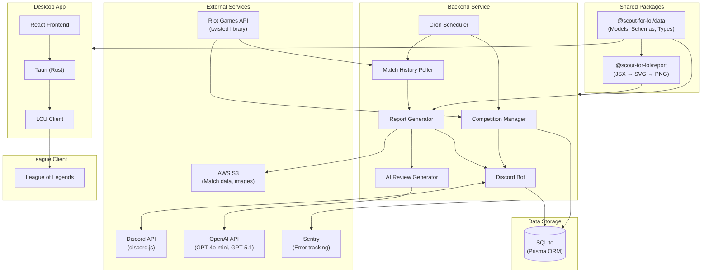
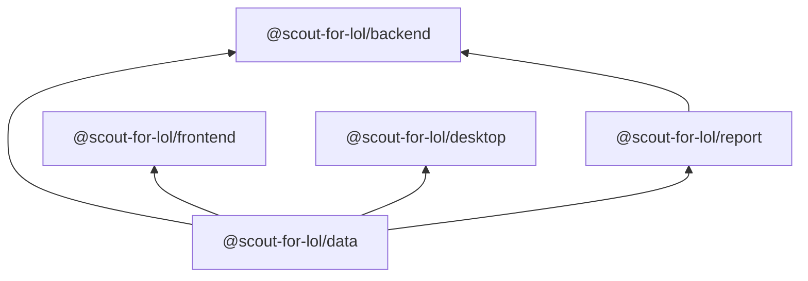
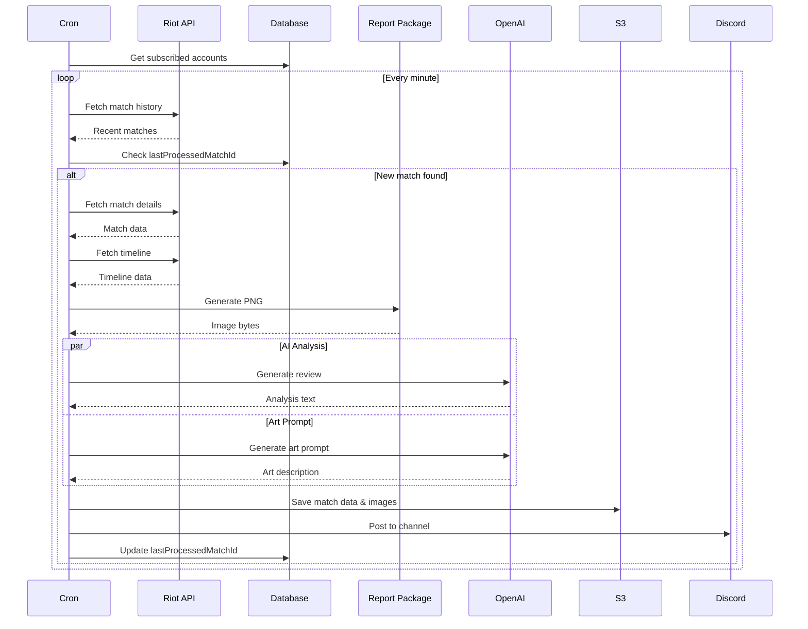
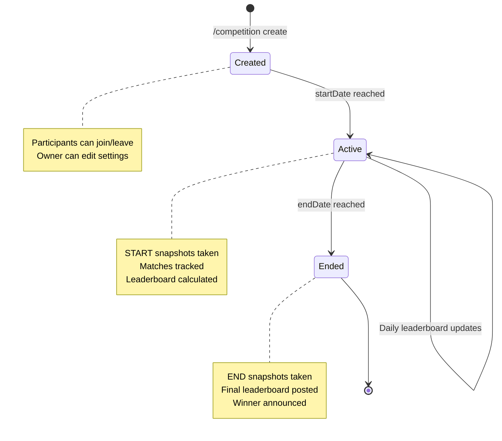
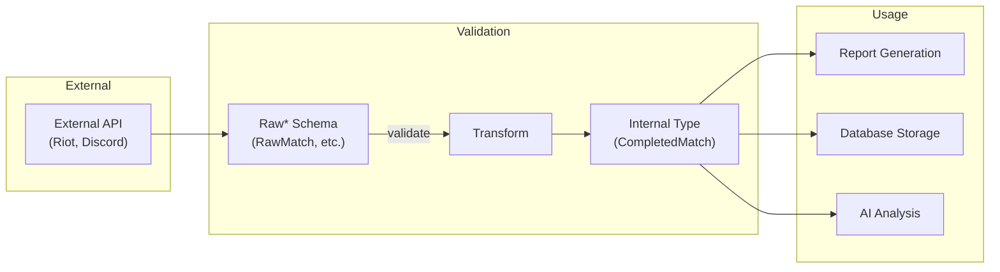
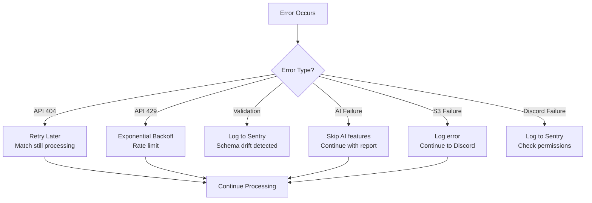
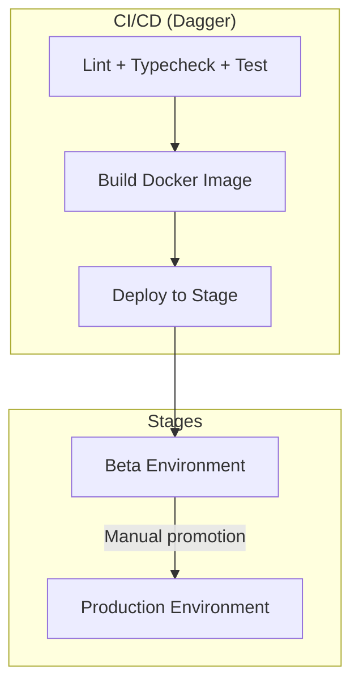

# Architecture Overview

Scout for LoL is a full-stack application built as a Bun monorepo with TypeScript. This document describes the high-level architecture and how components interact.

## System Architecture

## Package Dependency Graph

## Core Data Flow

### Match Report Generation

The primary flow from match detection to Discord notification:

### Competition Lifecycle

## Component Responsibilities

### Backend Service

| Component           | Responsibility                                          |
| ------------------- | ------------------------------------------------------- |
| Discord Bot         | Command handling, message posting, embed creation       |
| Match Poller        | Periodic match history checking for subscribed accounts |
| Report Generator    | Orchestrates match data → PNG report pipeline           |
| AI Review           | GPT-4o-mini match analysis, art prompt generation       |
| Competition Manager | Leaderboard calculation, snapshot management            |
| Cron Scheduler      | Schedules periodic tasks (polling, cleanup, updates)    |

### Data Package

| Export           | Purpose                                                 |
| ---------------- | ------------------------------------------------------- |
| Zod Schemas      | Validate external API responses (RawMatch, RawTimeline) |
| Model Types      | Shared TypeScript types (Player, Match, Competition)    |
| Review Utilities | Match data curation, prompt construction                |
| Constants        | Art styles, themes, lane contexts                       |

### Report Package

| Export                    | Purpose                             |
| ------------------------- | ----------------------------------- |
| `matchToSvg()`            | Render CompletedMatch to SVG string |
| `matchToImage()`          | Render CompletedMatch to PNG bytes  |
| `arenaMatchToSvg/Image()` | Arena mode variants                 |
| `svgToPng()`              | Convert SVG string to PNG           |

### Desktop Application

| Module         | Responsibility                                  |
| -------------- | ----------------------------------------------- |
| Tauri Core     | Window management, IPC, system integration      |
| LCU Client     | Connect to League Client Update API             |
| React Frontend | User interface for monitoring and configuration |

## Validation Architecture

All external data flows through Zod validation:

## Error Handling Strategy

## Deployment Architecture

## Environment Configuration

Required environment variables by component:

| Variable         | Component | Required               |
| ---------------- | --------- | ---------------------- |
| `DISCORD_TOKEN`  | Backend   | Yes                    |
| `APPLICATION_ID` | Backend   | Yes                    |
| `RIOT_API_TOKEN` | Backend   | Yes                    |
| `DATABASE_URL`   | Backend   | Yes                    |
| `OPENAI_API_KEY` | Backend   | No (disables AI)       |
| `S3_BUCKET_NAME` | Backend   | No (disables storage)  |
| `SENTRY_DSN`     | Backend   | No (disables tracking) |

## Next Steps

- [Backend Service](./backend.md) - Detailed backend architecture
- [AI Review System](./ai-review-system.md) - AI pipeline details
- [Desktop Application](./desktop.md) - Tauri app architecture
- [Database Schema](./database.md) - Data model documentation
