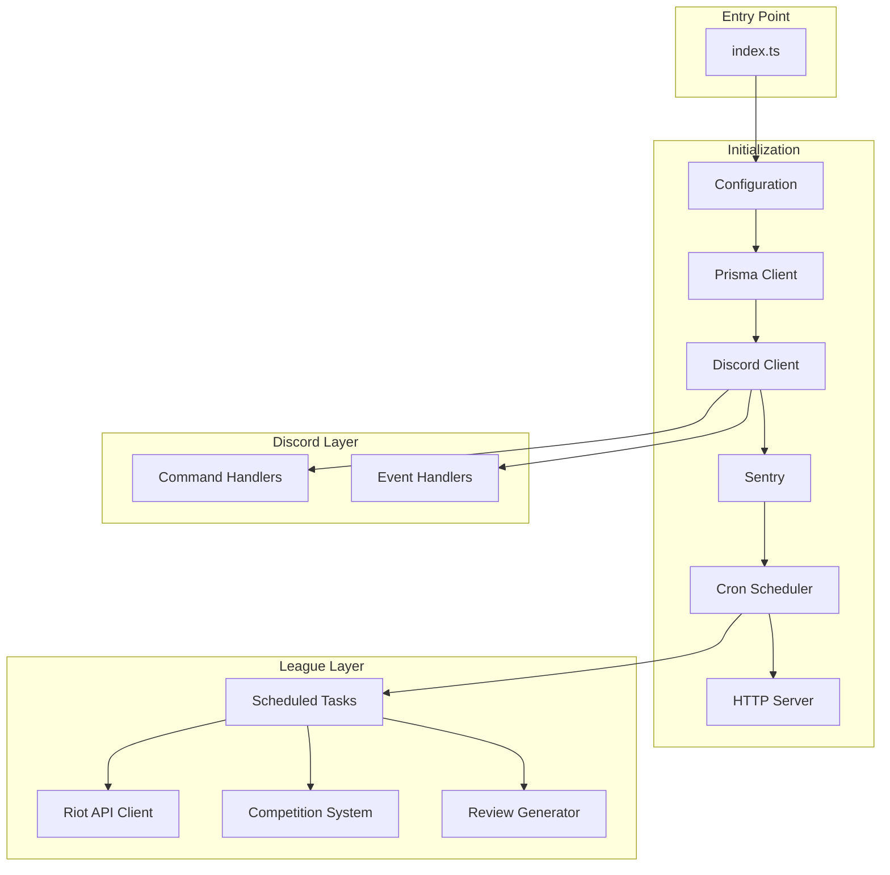
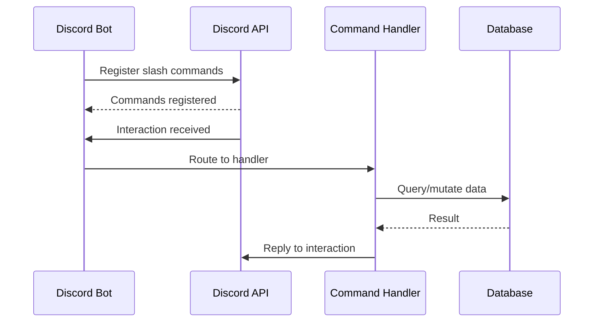
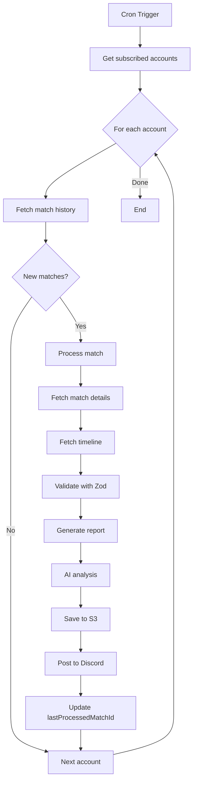
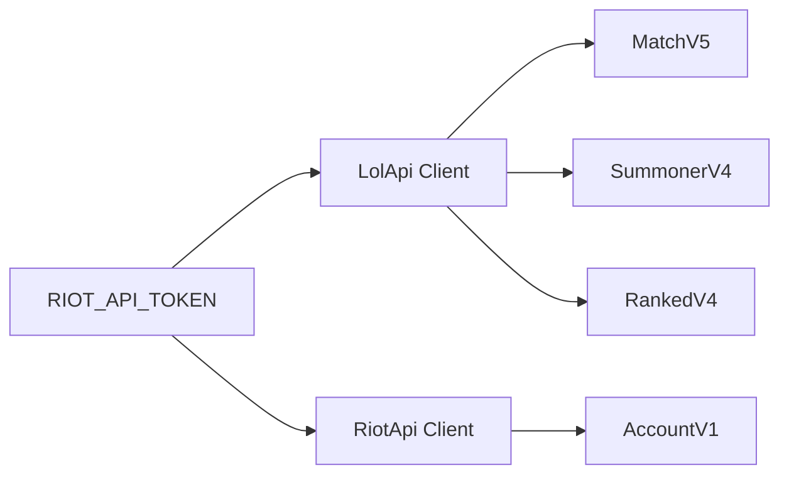
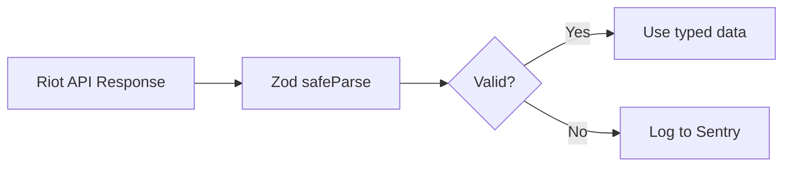
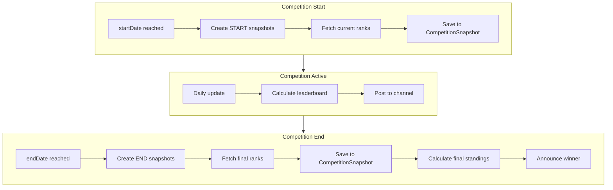
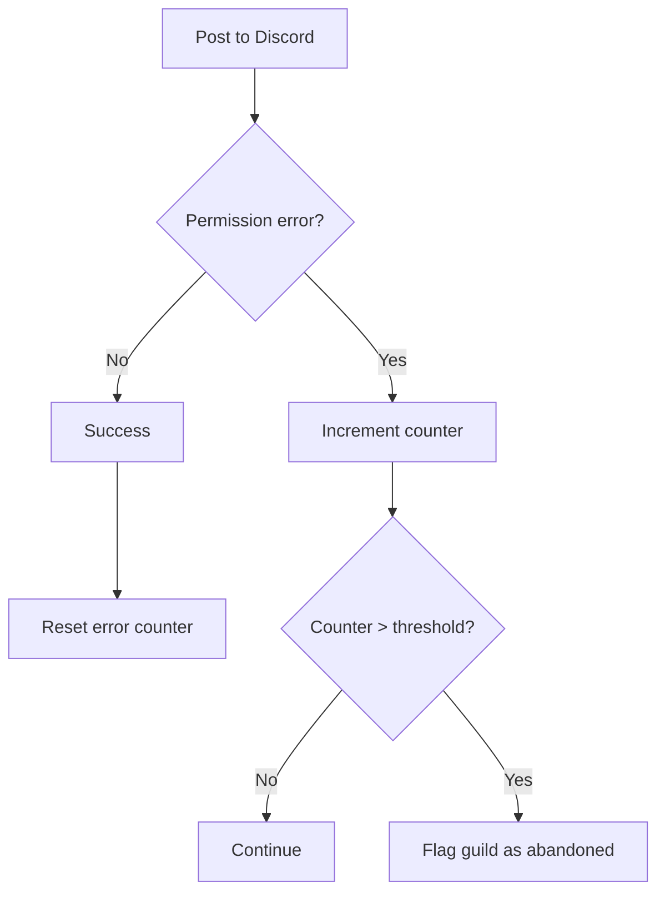

# Backend Service Architecture

The backend service is a Discord bot that monitors League of Legends matches, generates reports, and manages competitions. It runs as a long-lived process with scheduled cron jobs.

## Service Overview



## Discord Bot Architecture

### Command Structure

Commands are organized by category in `src/discord/commands/`:

```text
commands/
├── admin/           # Server admin commands
│   ├── account-add.ts
│   ├── account-delete.ts
│   ├── account-transfer.ts
│   ├── player-add.ts
│   ├── player-delete.ts
│   └── player-list.ts
├── competition/     # Competition management
│   ├── create.ts
│   ├── cancel.ts
│   ├── edit.ts
│   ├── invite.ts
│   ├── join.ts
│   ├── leave.ts
│   ├── list.ts
│   └── view.ts
├── subscription/    # Match notifications
│   ├── subscribe.ts
│   ├── delete.ts
│   ├── list.ts
│   └── welcome-match.ts
└── debug/           # Debug utilities
    ├── force-snapshot.ts
    └── force-leaderboard.ts
```

### Command Registration Flow



### Command Implementation Pattern

Each command exports:

- `data`: SlashCommandBuilder definition
- `execute`: Async handler function

```typescript
// Example: src/discord/commands/subscription/subscribe.ts
export const data = new SlashCommandBuilder()
  .setName("subscribe")
  .setDescription("Subscribe to match notifications")
  .addUserOption(/* ... */);

export async function execute(interaction: ChatInputCommandInteraction) {
  // Validate input with Zod
  // Query/mutate database
  // Reply to interaction
}
```

## Cron Job System

### Schedule Overview

```mermaid
gantt
    title Cron Job Schedule (UTC)
    dateFormat HH:mm
    axisFormat %H:%M

    section Every Minute
    Match Polling        :active, 00:00, 1m

    section Every 15 Minutes
    Competition Lifecycle :00:00, 15m

    section Hourly
    Data Validation      :00:00, 1h

    section Daily
    Leaderboard Update   :00:00, 1m
    Player Pruning       :03:00, 1m
    Guild Cleanup        :04:00, 1m
```



### Task Definitions

| Task                        | Schedule         | Description                       |
| --------------------------- | ---------------- | --------------------------------- |
| `checkPostMatch`            | `0 * * * * *`    | Poll match history for new games  |
| `runLifecycleCheck`         | `0 */15 * * * *` | Check competition start/end dates |
| `runDataValidation`         | `0 0 * * * *`    | Clean orphaned data               |
| `runDailyLeaderboardUpdate` | `0 0 0 * * *`    | Post daily leaderboards           |
| `runPlayerPruning`          | `0 0 3 * * *`    | Remove inactive players           |
| `runAbandonedGuildCleanup`  | `0 0 4 * * *`    | Identify inactive servers         |

### Match Polling Flow



## Riot Games API Integration

### API Client Setup



### Rate Limiting

The `twisted` library handles rate limiting automatically:

- **Retry attempts**: 3
- **Concurrency**: 1 (sequential requests)
- **Backoff**: Built-in exponential backoff

### Data Validation

All API responses are validated with Zod schemas:



Schemas defined in `@scout-for-lol/data`:

- `RawMatchSchema` - Match data
- `RawTimelineSchema` - Match timeline
- `RawSummonerLeagueSchema` - Rank data

## Competition System

### Competition Criteria

| Criteria             | Description               |
| -------------------- | ------------------------- |
| `MOST_GAMES_PLAYED`  | Total games in period     |
| `HIGHEST_RANK`       | Current rank (tier + LP)  |
| `MOST_RANK_CLIMB`    | LP gained from start      |
| `MOST_WINS_PLAYER`   | Total wins                |
| `MOST_WINS_CHAMPION` | Wins on specific champion |
| `HIGHEST_WIN_RATE`   | Win percentage            |

### Snapshot System



### Leaderboard Processors

Each criteria has a dedicated processor in `src/league/competition/processors/`:

```typescript
// Example: most-rank-climb.ts
export async function processLeaderboard(
  competition: Competition,
  participants: Participant[],
  startSnapshots: Snapshot[],
  endSnapshots: Snapshot[],
): Promise<LeaderboardEntry[]> {
  // Calculate LP difference between snapshots
  // Sort by climb amount
  // Return ranked entries
}
```

## HTTP Endpoints

The backend exposes two HTTP endpoints:

| Endpoint       | Purpose                       |
| -------------- | ----------------------------- |
| `GET /ping`    | Health check (returns "pong") |
| `GET /metrics` | Prometheus metrics            |

### Metrics Exported

- `discord_connection_status` - Bot connection state
- `discord_guild_count` - Number of servers
- `discord_user_count` - Total users across servers
- `discord_latency_ms` - API latency
- Process metrics (memory, CPU)

## Error Handling

### Strategy by Error Type

| Error              | Handling                               |
| ------------------ | -------------------------------------- |
| API 404            | Retry later (match still processing)   |
| API 429            | Automatic backoff via twisted          |
| Validation failure | Log to Sentry, skip processing         |
| AI failure         | Continue without AI features           |
| S3 failure         | Log and continue to Discord            |
| Discord failure    | Log to Sentry, track permission errors |

### Permission Error Tracking



## File Structure

```text
packages/backend/
├── prisma/
│   └── schema.prisma        # Database schema
├── src/
│   ├── index.ts             # Entry point
│   ├── configuration.ts     # Environment config
│   ├── discord/
│   │   ├── client.ts        # Discord.js setup
│   │   ├── commands/        # Slash commands
│   │   └── events/          # Event handlers
│   ├── league/
│   │   ├── api/             # Riot API client
│   │   ├── competition/     # Competition system
│   │   ├── review/          # AI review generation
│   │   ├── tasks/           # Scheduled tasks
│   │   └── cron.ts          # Cron scheduler
│   ├── metrics/             # Prometheus metrics
│   └── sentry/              # Error tracking
└── package.json
```

## Next Steps

- [AI Review System](./ai-review-system.md) - How AI analysis works
- [Database Schema](./database.md) - Data model details
