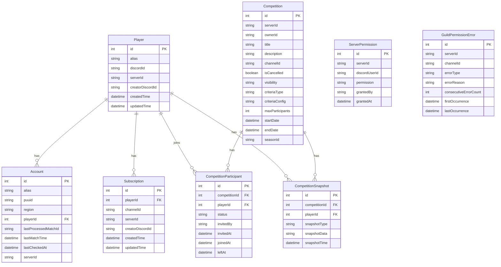
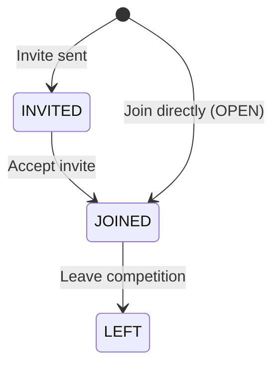
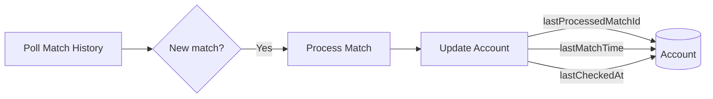
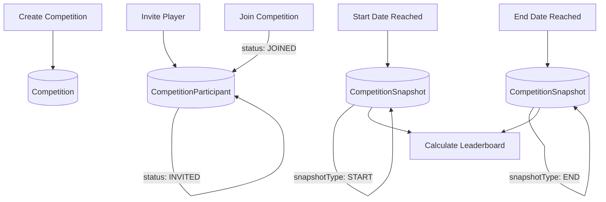

# Database Schema

Scout for LoL uses SQLite with Prisma ORM. This document describes the data model and relationships.

## Entity Relationship Diagram



## Models

### Player

Represents a Discord user who has been registered with the bot.

| Field              | Type     | Description                 |
| ------------------ | -------- | --------------------------- |
| `id`               | Int      | Auto-increment primary key  |
| `alias`            | String   | Display name for the player |
| `discordId`        | String?  | Discord user ID (optional)  |
| `serverId`         | String   | Discord server ID           |
| `creatorDiscordId` | String   | Who created this player     |
| `createdTime`      | DateTime | Creation timestamp          |
| `updatedTime`      | DateTime | Last update timestamp       |

**Unique constraint**: `[serverId, alias]`

**Relations**:

- `accounts`: One-to-many with Account
- `subscriptions`: One-to-many with Subscription
- `competitionParticipants`: One-to-many with CompetitionParticipant
- `competitionSnapshots`: One-to-many with CompetitionSnapshot

### Account

A League of Legends account linked to a player.

| Field                  | Type      | Description                     |
| ---------------------- | --------- | ------------------------------- |
| `id`                   | Int       | Auto-increment primary key      |
| `alias`                | String    | Display name for the account    |
| `puuid`                | String    | Riot PUUID (unique identifier)  |
| `region`               | String    | Riot region (NA1, EUW1, etc.)   |
| `playerId`             | Int       | Foreign key to Player           |
| `lastProcessedMatchId` | String?   | Last match ID we've processed   |
| `lastMatchTime`        | DateTime? | Timestamp of last match         |
| `lastCheckedAt`        | DateTime? | When we last polled for matches |
| `serverId`             | String    | Discord server ID               |

**Unique constraint**: `[serverId, puuid]`

**Match Tracking Fields**:

- `lastProcessedMatchId`: Prevents duplicate processing
- `lastMatchTime`: Used for dynamic polling frequency
- `lastCheckedAt`: Tracks polling intervals

### Subscription

Links a player to a Discord channel for match notifications.

| Field              | Type     | Description                   |
| ------------------ | -------- | ----------------------------- |
| `id`               | Int      | Auto-increment primary key    |
| `playerId`         | Int      | Foreign key to Player         |
| `channelId`        | String   | Discord channel ID            |
| `serverId`         | String   | Discord server ID             |
| `creatorDiscordId` | String   | Who created this subscription |
| `createdTime`      | DateTime | Creation timestamp            |
| `updatedTime`      | DateTime | Last update timestamp         |

**Unique constraint**: `[serverId, playerId, channelId]`

### Competition

A team competition with leaderboard tracking.

| Field              | Type      | Description                        |
| ------------------ | --------- | ---------------------------------- |
| `id`               | Int       | Auto-increment primary key         |
| `serverId`         | String    | Discord server ID                  |
| `ownerId`          | String    | Discord user ID of owner           |
| `title`            | String    | Competition name                   |
| `description`      | String    | Competition description            |
| `channelId`        | String    | Discord channel for updates        |
| `isCancelled`      | Boolean   | Whether competition is cancelled   |
| `visibility`       | String    | OPEN, INVITE_ONLY, SERVER_WIDE     |
| `criteriaType`     | String    | Leaderboard criteria type          |
| `criteriaConfig`   | String    | JSON configuration for criteria    |
| `maxParticipants`  | Int       | Maximum participants (default: 50) |
| `startDate`        | DateTime? | Fixed start date                   |
| `endDate`          | DateTime? | Fixed end date                     |
| `seasonId`         | String?   | OR use a ranked season             |
| `startProcessedAt` | DateTime? | When start was processed           |
| `endProcessedAt`   | DateTime? | When end was processed             |

**Visibility Options**:

- `OPEN`: Anyone can join
- `INVITE_ONLY`: Requires invitation
- `SERVER_WIDE`: All server members eligible

**Criteria Types**:

- `MOST_GAMES_PLAYED`
- `HIGHEST_RANK`
- `MOST_RANK_CLIMB`
- `MOST_WINS_PLAYER`
- `MOST_WINS_CHAMPION`
- `HIGHEST_WIN_RATE`

**Time Configuration**: Uses XOR logic - either `startDate`/`endDate` OR `seasonId`.

**Indices**:

- `[serverId, isCancelled]`
- `[serverId, ownerId, isCancelled]`

### CompetitionParticipant

Tracks player participation in competitions.

| Field           | Type      | Description                 |
| --------------- | --------- | --------------------------- |
| `id`            | Int       | Auto-increment primary key  |
| `competitionId` | Int       | Foreign key to Competition  |
| `playerId`      | Int       | Foreign key to Player       |
| `status`        | String    | INVITED, JOINED, LEFT       |
| `invitedBy`     | String?   | Discord user ID who invited |
| `invitedAt`     | DateTime? | When invited                |
| `joinedAt`      | DateTime? | When joined                 |
| `leftAt`        | DateTime? | When left                   |

**Unique constraint**: `[competitionId, playerId]`

**Status Flow**:



### CompetitionSnapshot

Stores player rank/stats at competition start and end.

| Field           | Type     | Description                |
| --------------- | -------- | -------------------------- |
| `id`            | Int      | Auto-increment primary key |
| `competitionId` | Int      | Foreign key to Competition |
| `playerId`      | Int      | Foreign key to Player      |
| `snapshotType`  | String   | START or END               |
| `snapshotData`  | String   | JSON with rank/stats data  |
| `snapshotTime`  | DateTime | When snapshot was taken    |

**Unique constraint**: `[competitionId, playerId, snapshotType]`

**Snapshot Data Structure** (stored as JSON):

```typescript
interface SnapshotData {
  rank: {
    tier: string; // IRON, BRONZE, etc.
    division: string; // I, II, III, IV
    lp: number;
  };
  wins: number;
  losses: number;
  gamesPlayed: number;
}
```

### ServerPermission

Grants users permissions within a Discord server.

| Field           | Type     | Description                 |
| --------------- | -------- | --------------------------- |
| `id`            | Int      | Auto-increment primary key  |
| `serverId`      | String   | Discord server ID           |
| `discordUserId` | String   | Discord user ID             |
| `permission`    | String   | Permission type             |
| `grantedBy`     | String   | Discord user ID who granted |
| `grantedAt`     | DateTime | When granted                |

**Unique constraint**: `[serverId, discordUserId, permission]`

**Permission Types**:

- `CREATE_COMPETITION`: Can create competitions

### GuildPermissionError

Tracks Discord permission errors for guild health monitoring.

| Field                   | Type      | Description                |
| ----------------------- | --------- | -------------------------- |
| `id`                    | Int       | Auto-increment primary key |
| `serverId`              | String    | Discord server ID          |
| `channelId`             | String    | Discord channel ID         |
| `errorType`             | String    | Type of permission error   |
| `errorReason`           | String?   | Detailed reason            |
| `firstOccurrence`       | DateTime  | First error timestamp      |
| `lastOccurrence`        | DateTime  | Most recent error          |
| `consecutiveErrorCount` | Int       | Error streak count         |
| `lastSuccessfulSend`    | DateTime? | Last successful message    |
| `ownerNotified`         | Boolean   | If owner was notified      |

**Unique constraint**: `[serverId, channelId]`

**Purpose**: Identifies abandoned guilds where the bot no longer has permissions.

## Data Flow Patterns

### Match Processing



### Competition Lifecycle



## Migrations

### Development

```bash
cd packages/backend
bun run db:push    # Push schema changes
bun run db:studio  # Open Prisma Studio
```

### Production

```bash
bun run db:migrate deploy  # Apply migrations
```

## Indices

| Model                  | Index                               | Purpose                     |
| ---------------------- | ----------------------------------- | --------------------------- |
| Competition            | `[serverId, isCancelled]`           | List active competitions    |
| Competition            | `[serverId, ownerId, isCancelled]`  | User's competitions         |
| CompetitionParticipant | `[competitionId, status]`           | List participants by status |
| GuildPermissionError   | `[serverId, consecutiveErrorCount]` | Find problematic guilds     |
| GuildPermissionError   | `[lastOccurrence]`                  | Recent errors               |

## Data Integrity

### Cascade Deletes

- Deleting a `Competition` cascades to:
  - `CompetitionParticipant`
  - `CompetitionSnapshot`

### Unique Constraints Summary

| Model                  | Constraint                                |
| ---------------------- | ----------------------------------------- |
| Player                 | `[serverId, alias]`                       |
| Account                | `[serverId, puuid]`                       |
| Subscription           | `[serverId, playerId, channelId]`         |
| CompetitionParticipant | `[competitionId, playerId]`               |
| CompetitionSnapshot    | `[competitionId, playerId, snapshotType]` |
| ServerPermission       | `[serverId, discordUserId, permission]`   |
| GuildPermissionError   | `[serverId, channelId]`                   |
