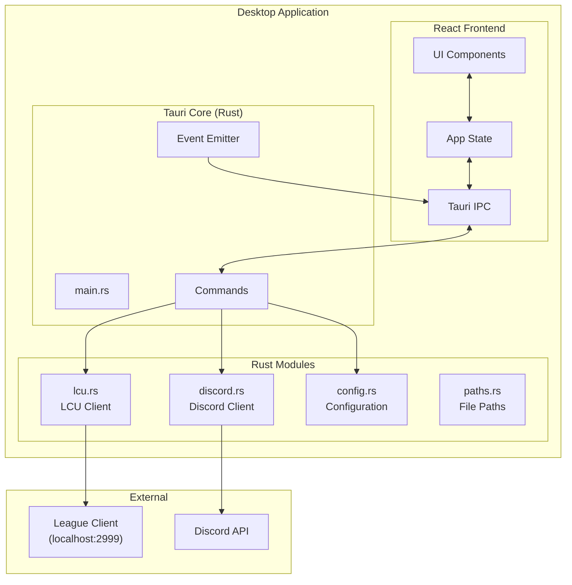
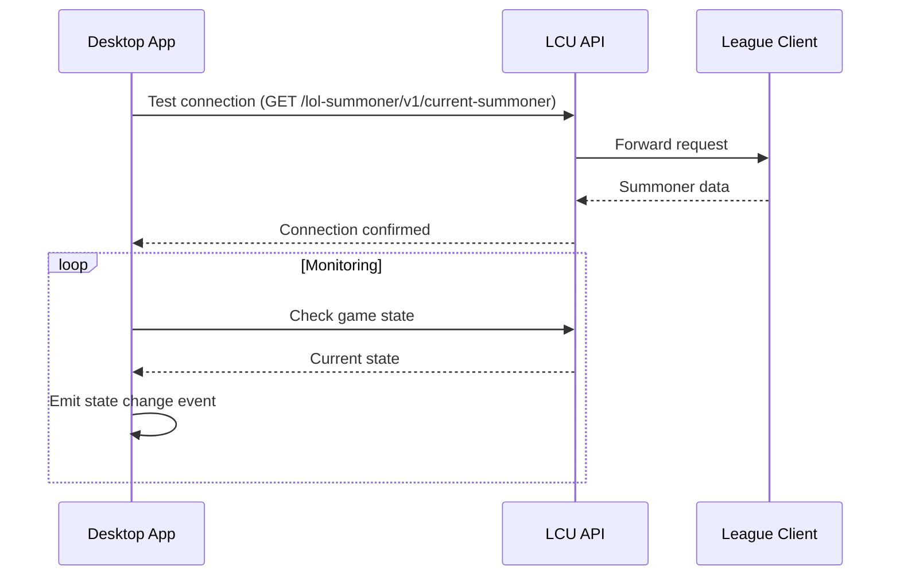
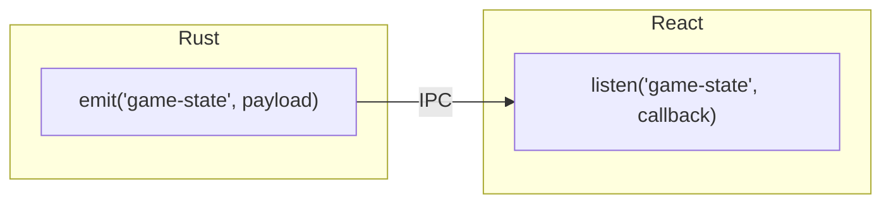
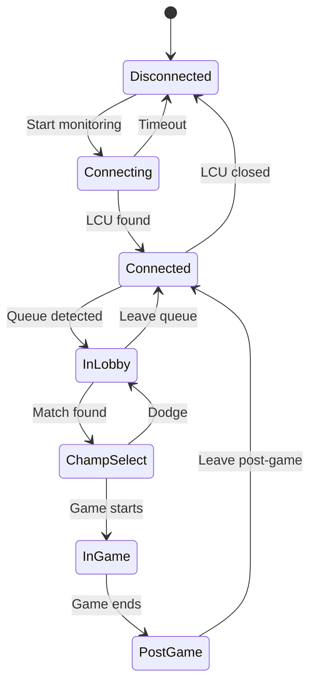

# Desktop Application

The desktop application is a Tauri-based client that monitors the League of Legends client locally and provides a native interface for Scout features.

## Technology Stack

| Layer     | Technology         |
| --------- | ------------------ |
| Framework | Tauri v2           |
| Backend   | Rust               |
| Frontend  | React + TypeScript |
| Styling   | Tailwind CSS       |
| Icons     | Lucide React       |

## Architecture Overview



## LCU Integration

The League Client Update (LCU) API allows local communication with the running League client.

### Connection Flow



### LCU Endpoints Used

| Endpoint                            | Purpose                     |
| ----------------------------------- | --------------------------- |
| `/lol-summoner/v1/current-summoner` | Get logged-in summoner info |
| `/lol-gameflow/v1/gameflow-phase`   | Check if in game            |
| `/lol-champ-select/v1/session`      | Champion select data        |

### Security Considerations

- LCU uses HTTPS with self-signed certificates
- Certificate validation is bypassed for localhost connections
- Connection is only accepted from localhost (port 2999)

## Tauri Commands

Commands are Rust functions exposed to the React frontend via IPC.

### Available Commands

```rust
// src-tauri/src/main.rs

#[tauri::command]
async fn get_lcu_status() -> Result<LcuStatus, String>

#[tauri::command]
async fn connect_discord(token: String) -> Result<(), String>

#[tauri::command]
async fn start_monitoring() -> Result<(), String>

#[tauri::command]
async fn get_game_state() -> Result<GameState, String>

#[tauri::command]
async fn get_summoner_info() -> Result<SummonerInfo, String>
```

### Calling from React

```typescript
import { invoke } from "@tauri-apps/api/core";

// Call Rust command
const status = await invoke<LcuStatus>("get_lcu_status");

// With parameters
await invoke("connect_discord", { token: "bot-token" });
```

## Event System

Tauri events enable Rust-to-React communication for real-time updates.



### Event Types

| Event               | Payload            | Triggered When         |
| ------------------- | ------------------ | ---------------------- |
| `game-state`        | `GameState`        | Game phase changes     |
| `connection-status` | `ConnectionStatus` | LCU connection changes |
| `summoner-update`   | `SummonerInfo`     | Summoner data updates  |

## Frontend Structure

```text
packages/desktop/src/
├── app.tsx                 # Root component
├── main.tsx                # Entry point
├── components/
│   ├── layout/
│   │   └── sidebar.tsx     # Navigation sidebar
│   ├── sections/
│   │   ├── league-section.tsx    # Account status
│   │   ├── discord-section.tsx   # Discord integration
│   │   ├── monitor-section.tsx   # Live monitoring
│   │   └── debug-panel.tsx       # Debug tools
│   └── ui/
│       ├── button.tsx
│       ├── card.tsx
│       ├── input.tsx
│       ├── badge.tsx
│       └── alert.tsx
├── hooks/
│   └── use-tauri-events.ts  # Event subscription hook
└── lib/
    └── tauri.ts             # IPC utilities
```

## Rust Module Structure

```text
packages/desktop/src-tauri/src/
├── main.rs          # Entry point, window setup, commands
├── lcu.rs           # LCU API client
├── discord.rs       # Discord bot integration
├── events.rs        # Event emission utilities
├── config.rs        # Configuration management
└── paths.rs         # File system paths
```

## Configuration

### Tauri Config (`tauri.conf.json`)

```json
{
  "productName": "Scout for LoL",
  "version": "0.1.0",
  "windows": [
    {
      "title": "Scout for LoL",
      "width": 900,
      "height": 700,
      "minWidth": 800,
      "minHeight": 600
    }
  ],
  "security": {
    "csp": "default-src 'self'; connect-src https://discord.com wss://gateway.discord.gg"
  }
}
```

### App Data Storage

| Path                              | Content            |
| --------------------------------- | ------------------ |
| `{APP_DATA}/config.json`          | User configuration |
| `{APP_DATA}/logs/startup-log.txt` | Application logs   |

## Features

### 1. Account Status

Displays current League account information:

- Summoner name and level
- Current rank
- LCU connection status

### 2. Discord Integration

Configure Discord bot connection:

- Bot token input
- Connection status indicator
- Test message functionality

### 3. Live Monitoring

Real-time game state tracking:

- Queue detection
- Champion select monitoring
- In-game status
- Post-game detection

### 4. Debug Panel

Development tools:

- Manual LCU status check
- Event log viewer
- State inspector

## State Management



## Building

### Development

```bash
cd packages/desktop
bun run dev          # Start dev server
bun run tauri dev    # Start Tauri dev mode
```

### Production

```bash
bun run tauri build  # Build release binary
```

### Output

| Platform | Output              |
| -------- | ------------------- |
| Windows  | `.exe` installer    |
| macOS    | `.dmg` or `.app`    |
| Linux    | `.deb`, `.AppImage` |

## Security

### CSP Policy

The Content Security Policy restricts:

- Script sources to 'self'
- Connections to Discord and localhost only
- No inline scripts

### Permissions

Tauri capabilities requested:

- File system access (config storage)
- Network access (LCU, Discord)
- Window management

## Future Considerations

- Auto-updater integration
- System tray minimization
- Notification support for match events
- Overlay mode during games
